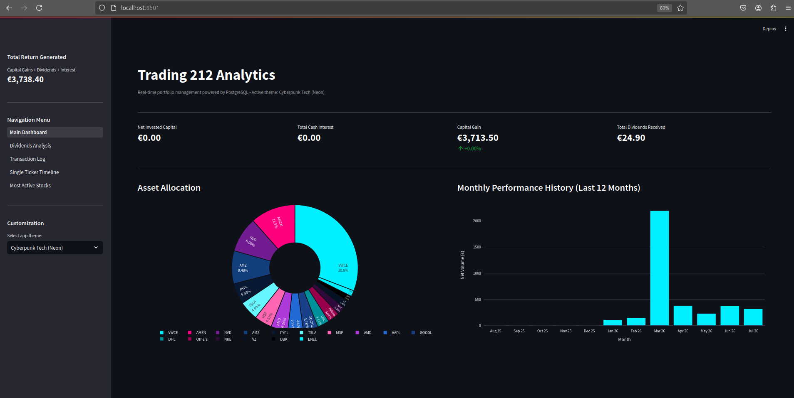
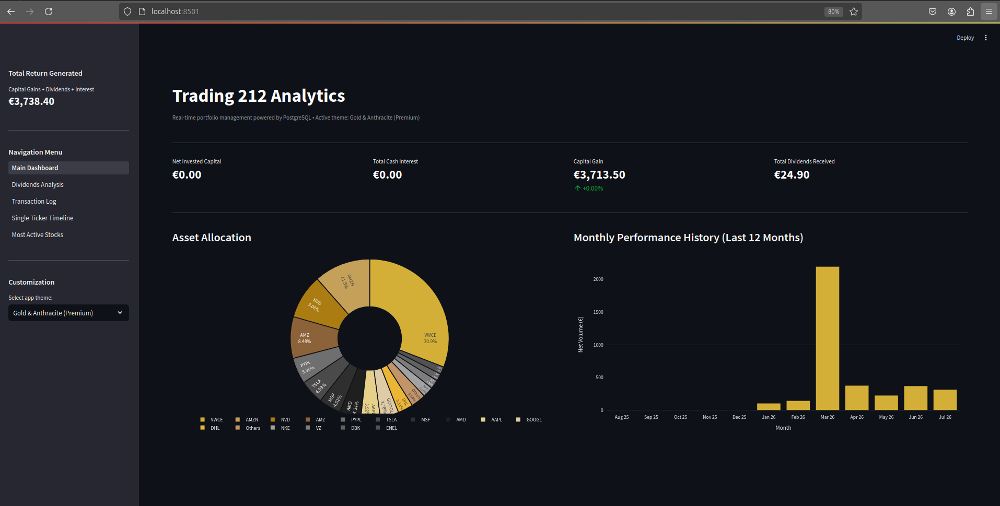
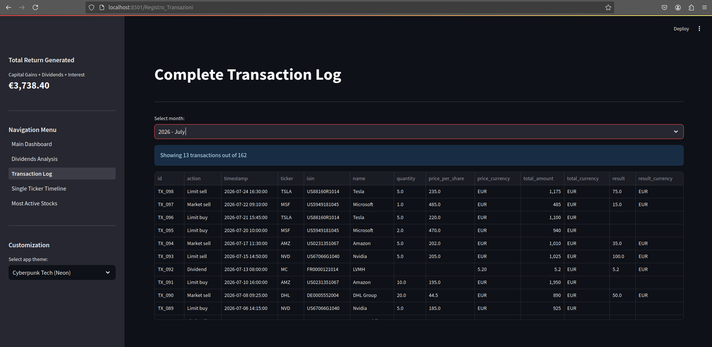
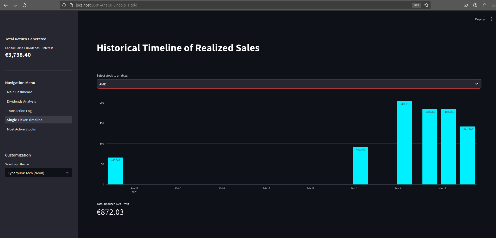
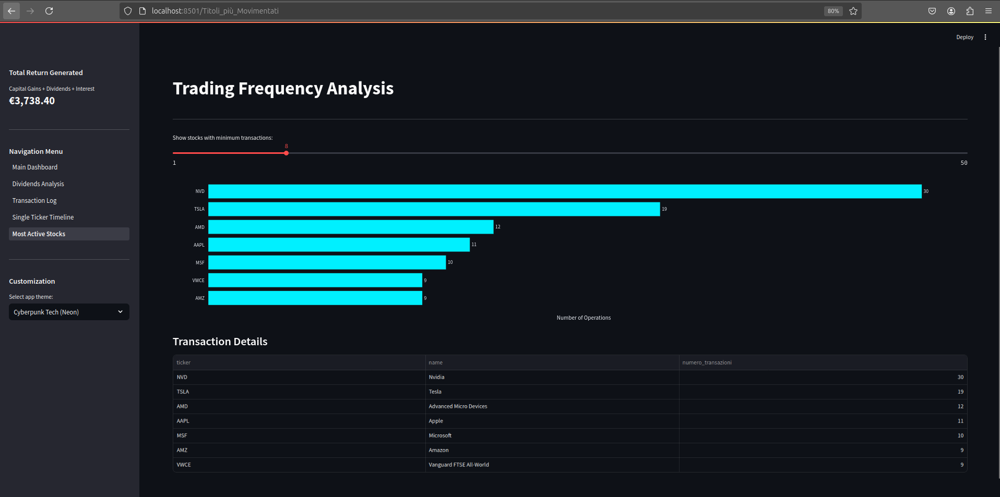

# Trading 212 Analytics Dashboard

> Full-stack portfolio analytics app for Trading 212 users. Features a PostgreSQL ledger backend and a dynamic Streamlit UI to track real capital gains, automated asset allocation, and historical performance. Local, private, and Docker-ready.

A modern, local financial analytics application built with Streamlit, Plotly, and PostgreSQL to process, analyze, and visualize Trading 212 account transaction logs.

# How to Run

### Prerequisites

- Docker installed and running
- Docker Compose
- For Hybrid Mode only: Python 3.10+ installed locally

---

### 1. Prepare your Data

1. Export your order history from Trading 212 as .csv files.
2. Place the downloaded .csv file(s) inside the exports/ folder:

exports/
├── Trading212_Export_1.csv
└── Trading212_Export_2.csv

Tip: To test the app with sample data, copy the files from sample_exports/ into exports/.

---

### 2. Choose Execution Mode

Make the shell scripts executable (first time only):

```bash
chmod +x start_docker_mode.sh start_hybrid_mode.sh
```

#### Option A: Full Docker Mode (Recommended)

Runs PostgreSQL, pgAdmin, and Streamlit entirely inside Docker containers.

```bash
./start_docker_mode.sh
```

#### Option B: Hybrid Mode (For Developers)

Runs PostgreSQL and pgAdmin in Docker, but runs Streamlit locally on your machine for quick code editing and hot-reloading.

1. Install Python dependencies locally:
   
   ```bash
   pip install -r requirements.txt
   ```

2. Start the hybrid environment:
   
   ```bash
   ./start_hybrid_mode.sh
   ```

---

### 3. Access the Services

Once started, access the interfaces via your browser:

- Streamlit Dashboard: http://localhost:8501
- pgAdmin 4: http://localhost:8080 (User: admin@trading.com / Pass: admin_password)
- PostgreSQL DB: localhost:5432 (User: trading_user / Pass: trading_password / DB: trading212)

---

### 4. Database Management & Useful Commands

Import New CSV Files (if added without restarting Docker):

- Docker Mode: docker exec -it t212_streamlit python db_importer.py
- Hybrid / Local Mode: python db_importer.py

Reset / Wipe Database (Nuke):

- Docker Mode: docker exec -it t212_streamlit python nuke_db.py
- Hybrid / Local Mode: python nuke_db.py

Container Management:

- View live runtime logs: docker compose logs -f
- Stop all services: docker compose down

## Screenshots

### Main Dashboard & Customization

<table width="100%">
  <tr>
    <td width="50%">
      <p align="center"><b>Portfolio Overview & Asset Allocation</b></p>
      
    </td>
    <td width="50%">
      <p align="center"><b>Theme Management & Customization</b></p>
      
    </td>
  </tr>
</table>

### Core Analytics Views

<table width="100%">
  <tr>
    <td width="33%">
      <p align="center"><b>Transaction Log Grid</b></p>
      
    </td>
    <td width="33%">
      <p align="center"><b>Single Ticker Timeline</b></p>
      
    </td>
    <td width="33%">
      <p align="center"><b>Trading Frequency Analysis</b></p>
      
    </td>
  </tr>
</table>

## Features

- **Centralized Database Storage:** Fully dynamic relational infrastructure powered by PostgreSQL.
- **Dynamic KPI Metrics Engine:** Accurate rolling tracking of Net Invested Capital, Total Cash Interest, Capital Gains, and Dividends.
- **Smart Asset Allocation:** Interactive, responsive Plotly charts featuring dynamic grouping thresholds (e.g., automated "Others" cluster generation for minor holdings).
- **Custom Multi-Theme System:** Injectable CSS configuration layer with pre-built theme setups (*Premium Gold*, *Teal Emerald*, *Cyberpunk Neon*, *Minimal Avio Blue*).
- **Frontend Serialization Safety:** Clean grid layouts with automated field parsing to safely view and filter complete transaction history datasets chronologically.

## Tech Stack

- **Backend / DB Processing:** Python, PostgreSQL, `psycopg2`, `pandas`
- **Frontend / Visualization:** Streamlit, Plotly Express, Plotly Graph Objects
- **Environment & Lifecycle Management:** Docker Compose, `python-dotenv`